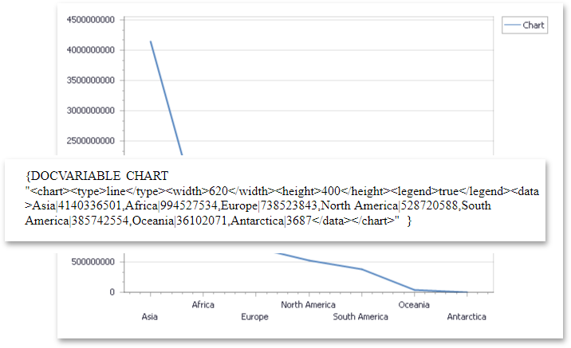

<!-- default badges list -->

<!-- default badges end -->

# Rich Text Editor for WPF - How to Use a DOCVARIABLE field to Embed a Live Chart into a Document

This example shows how to use a [DOCVARIABLE](https://docs.devexpress.com/WindowsForms/9721/controls-and-libraries/rich-text-editor/fields/field-codes/docvariable) field with custom parameters to embed a live chart into a document.

## Files to Review

* [ChartImage.cs](./CS/RichEdit_InsertChart/ChartImage.cs) (VB: [ChartImage.vb](./VB/RichEdit_InsertChart/ChartImage.vb))
* [MainWindow.xaml](./CS/RichEdit_InsertChart/MainWindow.xaml) (VB: [MainWindow.xaml](./VB/RichEdit_InsertChart/MainWindow.xaml))
* [MainWindow.xaml.cs](./CS/RichEdit_InsertChart/MainWindow.xaml.cs) (VB: [MainWindow.xaml](./VB/RichEdit_InsertChart/MainWindow.xaml))

## More Examples

* [How to Use Document Variable (DOCVARIABLE) Fields to Insert Dynamic Content](https://github.com/DevExpress-Examples/how-to-use-docvariable-fields)

## Dcoumentation

* [How to: Insert Dynamic Content](https://docs.devexpress.com/WindowsForms/401204/controls-and-libraries/rich-text-editor/examples/automation/how-to-insert-dynamic-content)
<!-- feedback -->
## Does this example address your development requirements/objectives?

 

(you will be redirected to DevExpress.com to submit your response)
<!-- feedback end -->
